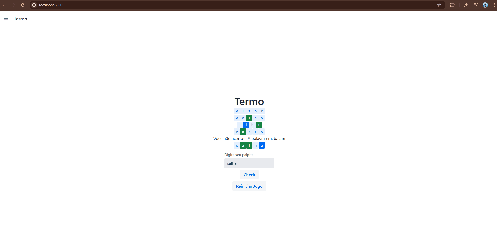
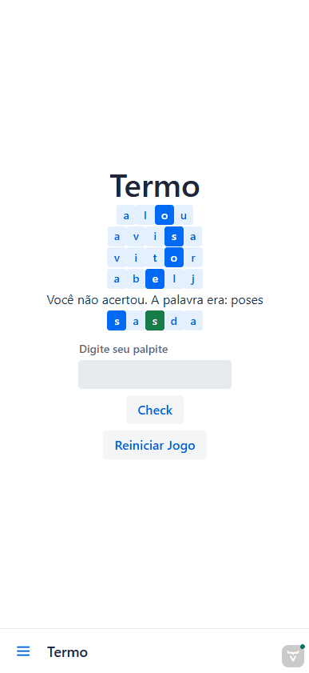
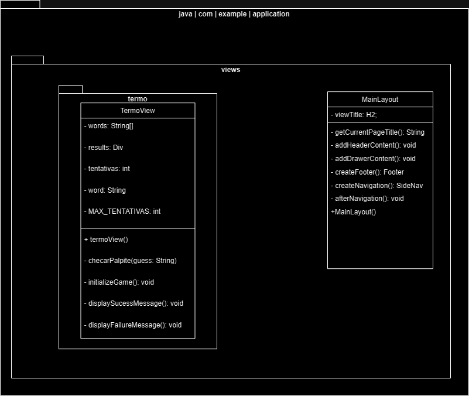

# 🧩 Termo Clone - Java

<p align="center">
  
  
  
  
  
</p>

---

## 📌 Sobre o Projeto
Este é um clone do popular jogo de palavras **Termo**, desenvolvido inteiramente em **Java**. O projeto foi criado como requisito parcial para a disciplina de **Programação Orientada a Objetos II**, sob a orientação do **Professor Leanderson Andre**.

O objetivo principal foi aplicar os pilares da POO no desenvolvimento de uma aplicação que exige lógica de validação de strings, manipulação de estados e interação com o usuário.

> **Nota Acadêmica:** Trabalho integrante do curso de Bacharelado em **Sistemas de Informação** e **Engenharia de Software**.

---

## 🎮 Demonstração & Deploy
Se você é um recrutador e quer ver o projeto funcionando agora mesmo:

* **🌐 Ver Online (Caso tenha deploy):** [Acesse o link do projeto]

### Execução do projeto (Web).



### Execução do projeto (Mobile).


---

## 🛠️ Tecnologias e Conceitos
* **Linguagem:** Java (JDK 17+)
* **Lógica de Jogo:** Comparação de vetores de caracteres para feedback visual (Verde, Amarelo, Cinza).
* **Framework Web:** **Vaadin** (Interface reativa e componentes Java-based)
* **Gerenciamento de Dependências:** Maven.
* **Infraestrutura:** Docker (Containerização para deploy padronizado).
* **Pilares de POO Aplicados:**
    * **Encapsulamento:** Proteção da lógica de sorteio e validação das palavras secretas.
    * **Abstração:** Representação fiel das regras de negócio do jogo original.
    * **Polimorfismo/Herança:** Classes de interface.

---

## 💻 Como Rodar na sua Máquina

### Pré-requisitos
* Java JDK 17 ou superior instalado.
* Uma IDE (IntelliJ, Eclipse ou VS Code).

### Passo a Passo
1. Clone este repositório:
   ```bash
   git clone [https://github.com/seu-usuario/nome-do-seu-repositorio.git](https://github.com/seu-usuario/nome-do-seu-repositorio.git)

2. No terminal, dentro da pasta do projeto, execute:
   ```bash
    bash
    mvn spring-boot:run

3. Acesse no seu navegador: http://localhost:8080


## 🐳 Como Rodar com Docker
Este projeto está containerizado, o que garante que ele rode perfeitamente em qualquer ambiente. O projeto utiliza imagens Docker baseadas em Eclipse Temurin para garantir conformidade com as práticas atuais de segurança e performance em ambientes de nuvem

1. **Construir a imagem:**
   ```bash
   docker build -t termogame .

2. **Executar o container::**
   ```bash
   docker run -p 8080:8080 termogame .


3. Acesse http://localhost:8080 no seu navegador.

## 🎯 Funcionalidades Implementadas

* [x] Interface Web responsiva com componentes Vaadin.

* [x] Sorteio de palavras dinâmico.

* [x] Feedback visual colorido (Verde, Amarelo e Cinza).

* [x] Teclado virtual integrado à tela.

* [x] Tratamento de tentativas e fim de jogo.
------------------------------------------------------------------------------------------------------------------------------------
### UML Diagram


## User Stories

### 1. Adivinhação da Palavra:

Como usuário, eu quero ser desafiado com palavras diferentes a cada rodada.

Critérios de aceitação: o usuário deve digitar as suas deduções para adivinhar a palavra. 

### 2. Feedback Visual da Adivinhação:

Como jogador, quero saber a correta posição da letra conforme a sua cor. 

Critérios de aceitação: o usuário deve digitar as deduções de letras 

### 3. Indicadores de Progresso

Como usuário, quero saber se acertei a letra e sua posição com a cor <span style="color:#2ECC71">Verde</span>

Como usuário, quero saber se acertei a letra, porém errei sua posição com a cor <span style="color:blue">Azul</span>.

Critérios de aceitação: o usuário deve digitar as deduções de letras 

### 4. Tentativas do Jogo

Como usuário, quero ter mais de uma tentativa para a palavra.

Critérios de aceitação: o usuário terá 5 tentativas para acertar a palavra.

### 5. Reinicialização do Jogo

Como usuário, quero poder reiniciar o jogo ao acertar ou errar uma palavra.

Critérios de aceitação: o usuário acertar ou errar alguma palavra após suas 5 tentativas.

### 6. Palavra Correta

Como usuário, em caso de erro nas 5 tentativas, quero saber qual a palavra correta.

Critérios de aceitação: o usuário errar as 5 tentativas.